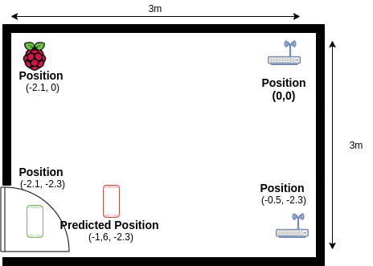
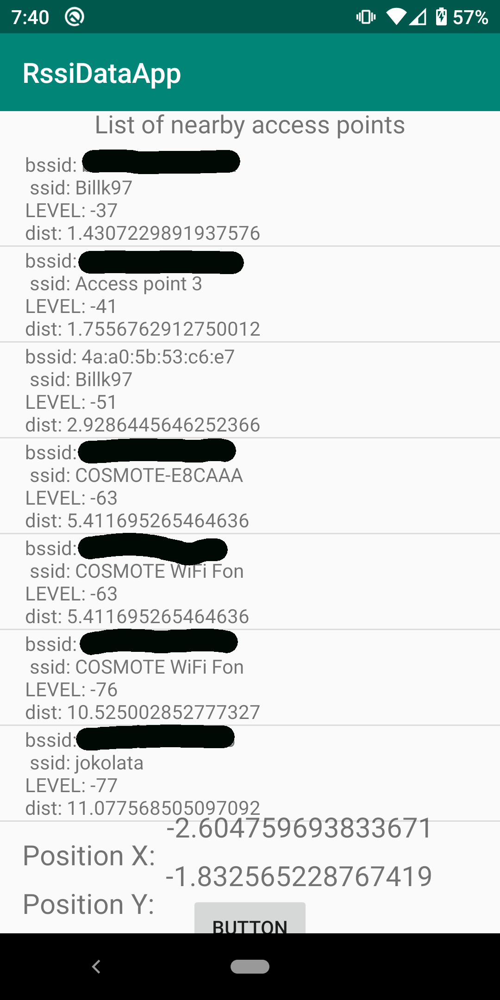

# Indoor-Tracking-App

This is an android app that using signal strength from nearby WiFi access points triangulates and find the position of the device.
**This app is in the early stages of development as such errors could occur**. 

The app has not yet established any connection to the application server.

## Requirements

The access to the WiFi signal data is heavily restricted and as such a lot of permission are required. The following is a list of permissions required. 
~~~xml
<uses-permission android:name="android.permission.ACCESS_WIFI_STATE" />
<uses-permission android:name="android.permission.CHANGE_WIFI_STATE" />
<uses-permission android:name="android.permission.ACCESS_FINE_LOCATION" />
<uses-permission android:name="android.permission.ACCESS_COARSE_LOCATION"/>
<uses-permission android:name="android.permission.INTERNET"/>
<uses-permission android:name="android.permission.ACCESS_NETWORK_STATE"/>
~~~
In addition to that in order the app to work correctly the wifi and location service **MUST** be enable. If the app is not working permission must be granted manual via the settings menu.

## How to make the app work 

1. Download the app from here
2. Edit the source code in order to add the positions of the access point and mac address.
3. Compile/ build the apk in your phone.
4. Warning if there are not 3 at least Known Access point added the app stops working 

# First test
The following image depicts the floorPlan in witch the test was contacted. The first access point was the home router. This position was considered as (0,0) and all other devices were placed related to this position. The values that are shown in the picture below are real and were measured with a meeter. 
  
After the first scan the above results where calculated by the app. As expected there is a small error between the actual position and the predicted. This could have happened for a number of reasons one of which may be tunning the Path loss calculation function. 

Other reasons/ info
* The device and access point where in close distance of one other.
* The was no object between the devices.
* Except of the Raspberry pi the signal strength transmitted by the access point are not known. Because of that i assume they transmit at -30dB

## Basic flow
##### How the app will communicate
(the image recognition part is not included)
1. The user opens the app for the first time.
2. The app asks from the server the location of the access Points as well as the signal strengths
3. The app scans for nearby access points and calculates the signal.
4. Thea app sends the location to the application server.
##### How the raspberry pi access points will communicate.
1. The access point will boot 
2. The access point will send to the server all the info needed like mac, transmission signal strength...
3. the server will register the access point.  
### Screenshot from the first app

